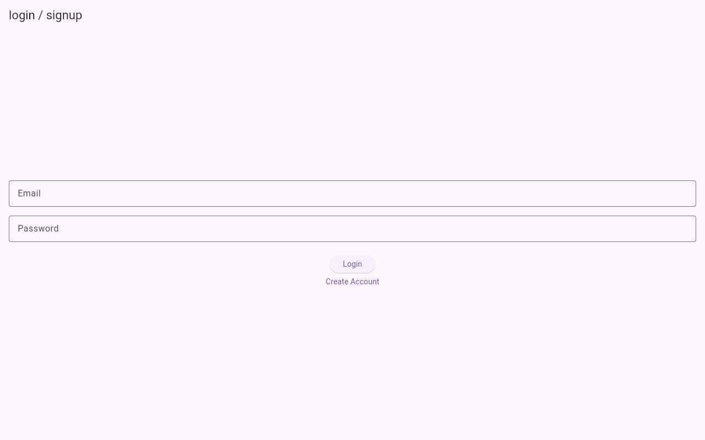
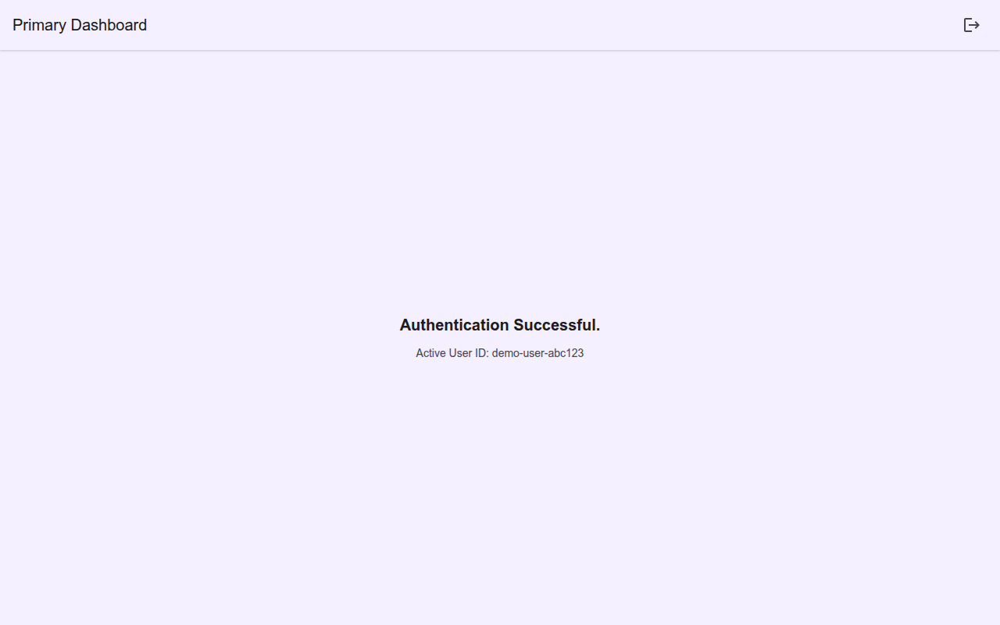

# Flutter Boilerplate — All Platforms

Step-by-step guides for building a Flutter app with **Firebase Auth** across **web, Android, iOS, and Windows**.

This repository contains **documentation and code snippets** for the learning path (not a full runnable app tree). Follow the guides in order, or jump to the platform you need.

## Screenshots

Login / signup (web):



Primary dashboard after authentication:



## Learning path

| Step | Topic | Guide |
|------|--------|--------|
| 1 | Firebase Auth + Firestore (feature-first layout) | [docs/01-firebase-auth](docs/01-firebase-auth/doc1.md) |
| 2 | Web + GoRouter | [docs/02-web](docs/02-web/doc2.md) |
| 3 | Android release signing | [docs/03-android](docs/03-android/doc3.md) |
| 4 | iOS / PWA notes | [docs/04-ios](docs/04-ios/doc4.md) · [doc5](docs/04-ios/doc5.md) |
| 5 | Windows desktop + MSIX packaging | [docs/05-windows](docs/05-windows/doc6.md) |

Each folder also includes matching `code_files*` snippets referenced by the docs.

## Prerequisites

- [Flutter](https://docs.flutter.dev/get-started/install) SDK
- A [Firebase](https://console.firebase.google.com/) project (Auth + Firestore enabled)
- Platform toolchains as needed (Chrome for web, Android Studio / Xcode, Visual Studio C++ for Windows)

## Repo layout

```text
README.md
screenshots/          # App UI previews
docs/
  01-firebase-auth/   # Auth feature foundation
  02-web/             # Web routing & hosting notes
  03-android/         # Android signing & release
  04-ios/             # iOS + PWA
  05-windows/         # Windows desktop + MSIX
```

## Security note

Signing examples use placeholders such as `YOUR_STORE_PASSWORD` / `YOUR_KEY_PASSWORD`. Never commit real keystore passwords or `.jks` files.

## License

Personal learning / boilerplate docs. Use and adapt as needed.
